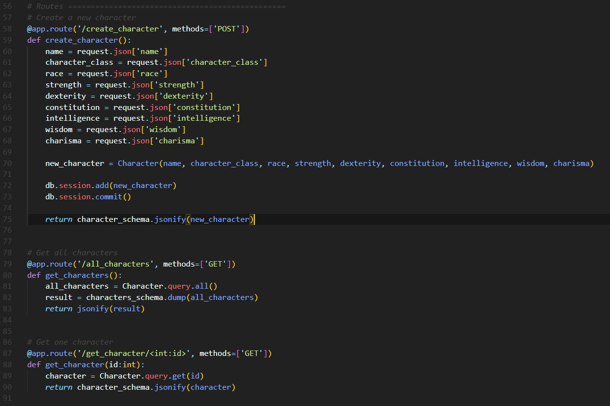

## Flask DnD
This repository's sole purpose is to teach how to create an API gateway with Python / Flask

Clone the **[React Flask Companion App](https://github.com/henrywinget/FlaskCompanionApp)** to use side by side and test some of your routes!